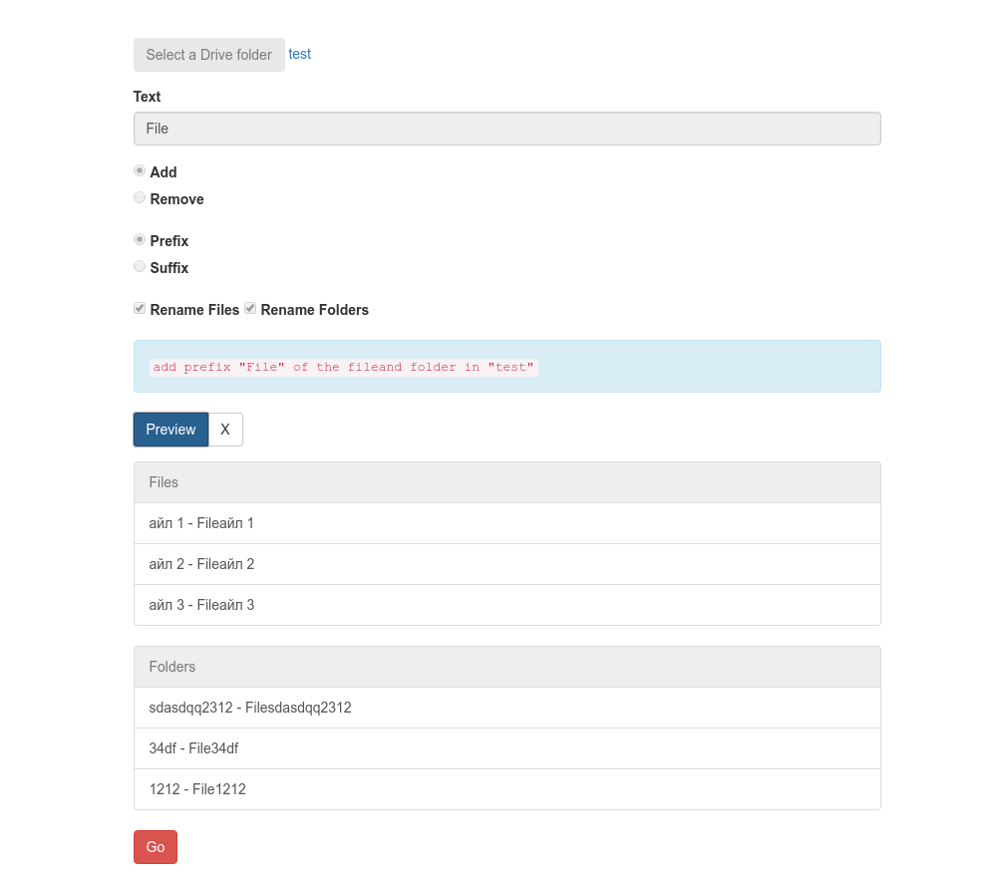

# RENAME FOLDERS AND FILES IN DRIVE
Filename Editor will add a prefix or suffix to all files (and subfolders) within a selected folder in Google Drive.

The tool has limitations due to the Google API and may return an error or skip files if you choose a folder with too many sub-folders or if Google returns an error we do not recognise. If you have lots of files to rename, or encounter any skipped files simply run the task again or choose a lower level folder.

To get started, choose a folder and your rename requirements and click "Preview" below. We will query your folders and files and display a summary of the activity the Editor will run through. Click "Go" to proceed with the renaming.

## Release

[Run the app](https://script.google.com/macros/s/AKfycbw2UjRmPSCyGnBI8Emo1NS5REi2JuhvkrU--bE3DptJiNY4pjD3/exec)

## Screenshots
